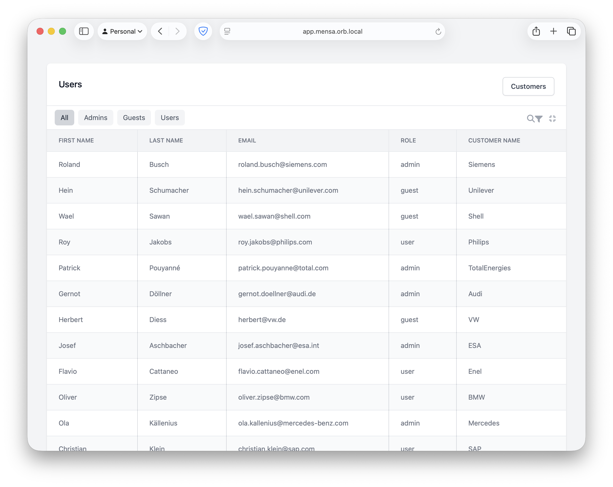
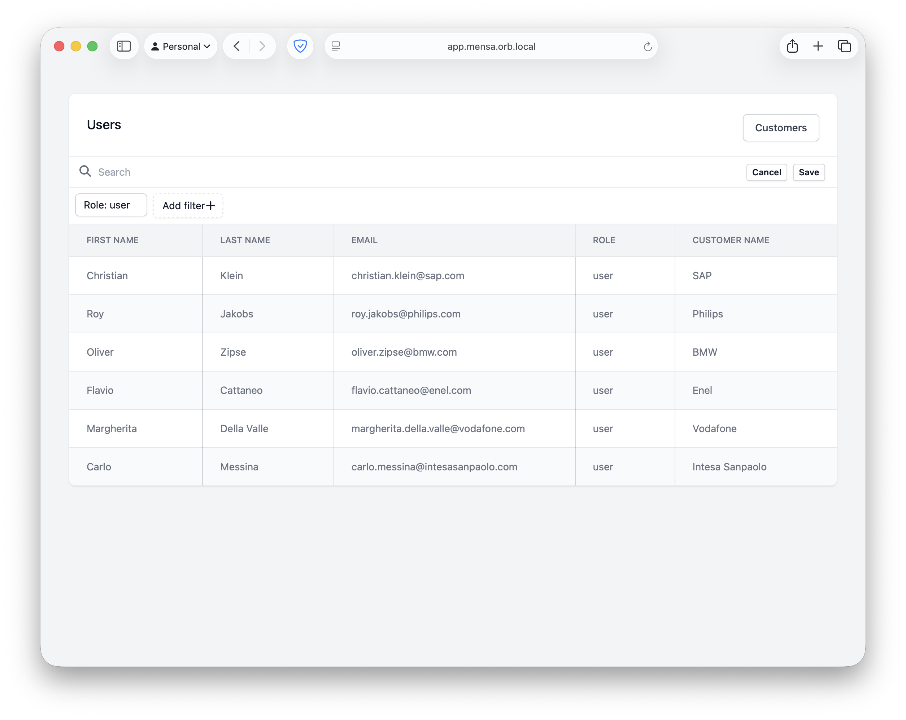

# Mensa

Fast and awesome tables, with pagination, sorting, filtering and custom views.




Features:

- [x] very fast
- [x] row-links
- [x] sorting
- [x] tables without headers (and without most of the above)
- [x] filtering of multiple columns
- [X] Hide filter icon in case there are no filters

Still to do:
- [ ] column sorting
- [ ] editing of existing filters
- [ ] view selection and exports per view
- [ ] multiple selection of rows

Optionally:

- [ ] group by
- [ ] sum/max/min
- [ ] tables backed by arrays (of ActiveModel)

Todo/Fixme:

- [ ] Search only works on table text columns

## Usage

Add tables in your app/tables folder, inheriting from ApplicationTable.
This in turn should inherit from Mensa::Base.

```ruby
class UserTable < ApplicationTable
  definition do
    model User # implicit from name

    order name: :desc

    column(:name) do
      attribute :name # Optional, we can deduct this from the column name
      sortable true
      sanitize true
      internal false
      visible true
      filter do
        collection -> { }
        scope -> { where(name: ...) }
      end
    end

    column(:nr_of_roles) do
      attribute "roles_count" # We use a database column here
    end

    # You can add one or more actions to a row
    action :delete do
      title "Delete row"
      link { |user| user_path(user) }
      icon "fa-regular fa-trash"
      link_attributes data: {"turbo-confirm": "Are you sure you want to delete the user?", "turbo-method": :delete}
      show ->(user) { true }
    end

    link { |user| edit_user_path(user) }
    supports_views true # This table supports custom views
    show_header true
    view_columns_ordering false # Disabled for now
    view_condensed false # Default false
    view_condensed_toggle true # Whether to show the toggle, default true

    # Add system views
    # Mensa will always create a systemview (:default) with name 'All' showing all records. 
    # If you want to rename it, for example because you don't show all records in your default scope, add it and give it a name like below.
    view :concept do
      name "Concept"
      filter :state do
        operator :equals
        value "concept"
      end
    end
  end
end
```

Currently mensa depends on satis, but that is something we might remove in a future version.
You can show your tables on the page using the following:

```slim
  = sts.table :users
```

#### Custom views

Custom views are views not defined by the developer (SystemViews) but by the end-user by adding/removing filters.

Initial support for custom-views is there, but pretty rudimentary:

`Mensa::TableView.create(table: "users", name: "Guests", config: {filters: {role: {value: "guest"}}})`

### Fast

Mensa selects only the data it needs, based on the columns. Sometimes it needs additional columns to do it's work, but you don't want them displayed.
This can be done by adding `internal true` to the column definition, or shorter: use `internal` instead

```ruby
internal :born_on 
column :age do
  attribute "EXTRACT(YEAR FROM AGE(born_on))::int"
end
```

## Development

### Coding

- Checkout this repo
- Setup your direnv, add the following to your `.envrc`:

  ```
  export BUNDLE_RUBYGEMS__PKG__GITHUB__COM=ghp_xxxxxxw
  export RBENV_VERSION=$(cat .ruby-version)
  ```

- Run `direnv allow`

If you use devcontainers:
- Open with Visual Studio Code (or with any other editor) and reopen in container.
- Run `bin/overmind s`

If you're not using devcontainers:
- Run `bin/overmind s`

### Docs

Using the following in your view will render Mensa::Table::Component
```slim
  = sts.table :users
```

The Mensa::Table::Component will render:
- Mensa::Search::Component
- Mensa::FilterPillList::Component
  - Mensa::FilterPill::Component
  - Mensa::AddFilter::Component
- Mensa::Views::Component
  - renders a views list
  - Mensa::ControlBar::Component
    - search icon
    - filter icon
    - condensed toggle
    - export icon
- turbo-frame with the actual table you see  (which is rendered by Mensa::View::Component)

## Installation

Add this line to your application's Gemfile:

```ruby
gem "mensa"
```

And then execute:

```bash
$ bundle
```

Or install it yourself as:

```bash
$ gem install mensa
```

Always use `bundle` to install the gem. Next use the install generator to install migrations, add an initializer and do other setup:

```bash
$  bin/rails g mensa:install
```

## Contributing

```
Contribution directions go here.


## License
The gem is available as open source under the terms of the [MIT License](https://opensource.org/licenses/MIT).
```
