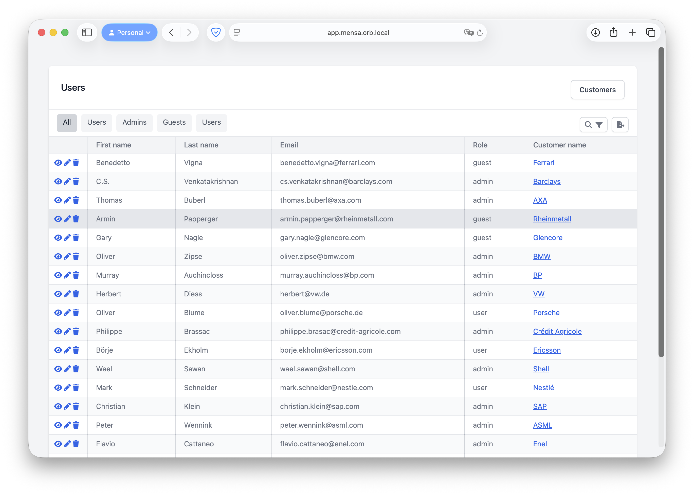
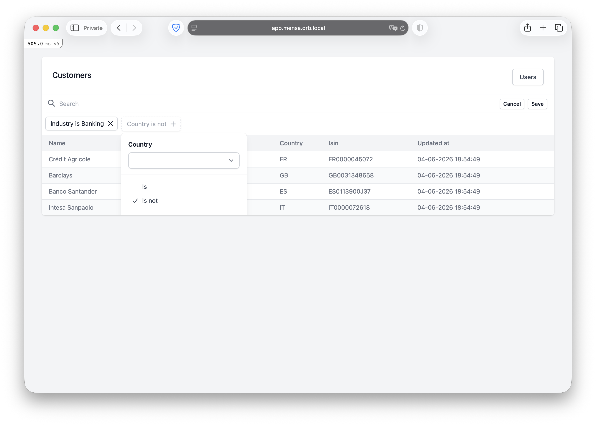
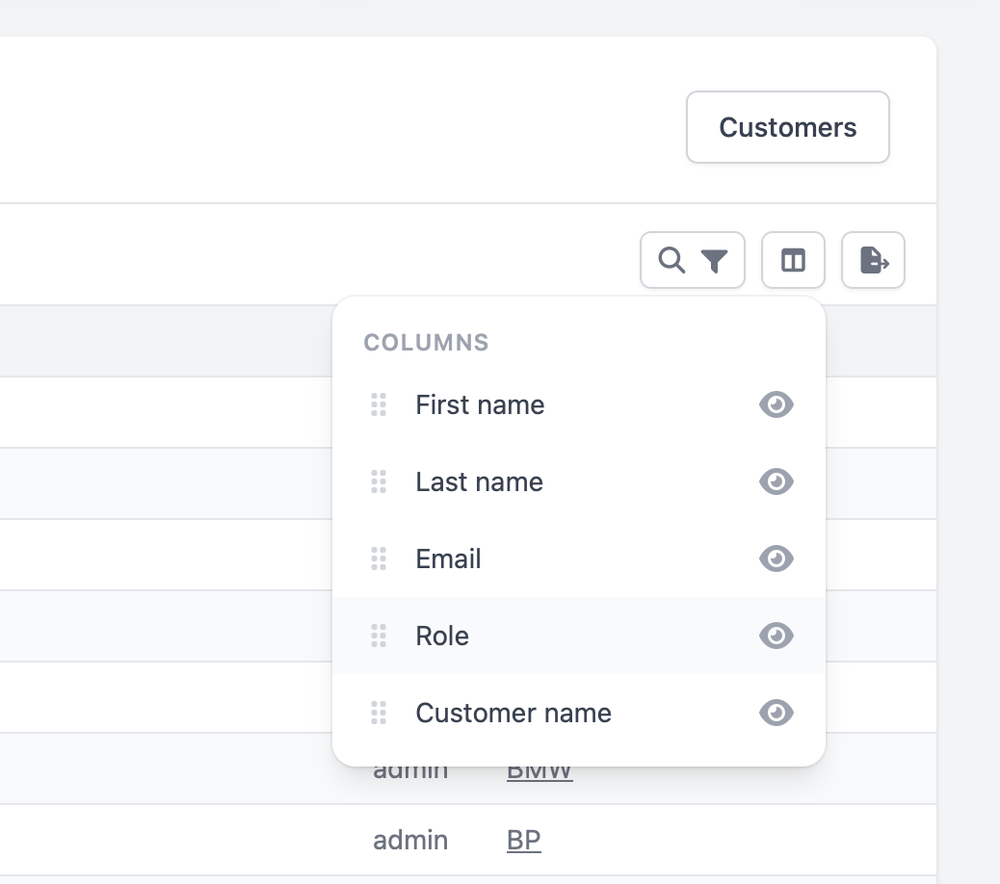
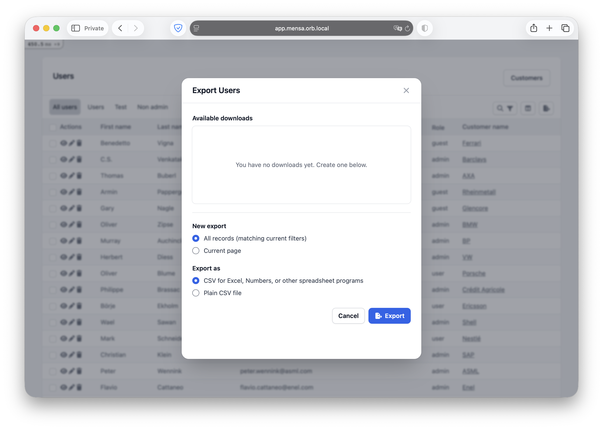

# Mensa

Fast and awesome tables, with pagination, sorting, filtering, batch processing, column hiding, column ordering and custom views.
Due to search, it only works with postgresql at the moment.






Features:
- [x] Very fast
- [x] Row-links
- [x] Sorting
- [x] Filtering of multiple columns
- [X] Hide filter icon in case there are no filters
- [X] Column ordering
- [X] Editing of existing filters
- [X] View selection and exports per view
- [X] Multiple selection of rows and batch processing
- [x] Tables without headers (and without most of the above)
- [X] Search works on all table columns
- [X] Exports can be scheduled to run recurring (daily/weekly/monthly/quarterly/bi-yearly/yearly)
      You will have to bring your own mailer, see configuration for details.
- [X] Grouping rows by a column, with collapsible groups and count/sum/min/max per group

Nice to haves:

- [ ] tables backed by arrays (of ActiveModel)

## Usage

Add tables in your app/tables folder, inheriting from ApplicationTable.
This in turn should inherit from Mensa::Base.

You can give columns an arbitrary name, it can match the database column, translations will be taken from `activerecord.attributes.<model>.<column>`:

```yaml
en: 
  activerecord:
    attributes:
      user:
        name: Full name
```

```ruby
class UserTable < ApplicationTable
  model User # implicit from name

  order name: :desc

  column(:name) do
    filter
  end

  column(:nr_of_roles) do
    attribute "roles_count" # We use a database column here
  end

  # Customize how a cell looks. Each cell is wrapped in a <td>, unless the html
  # block returns its own td, so you can style the td itself.
  column(:state) do
    render do
      html do |user|
        content_tag(:td, user.human_state_name, class: "state state--#{user.state}")
      end
    end
  end

  # You can add one or more actions to a row
  action :delete do
    title "Delete row"
    link { |user| user_path(user) }
    icon "fa-regular fa-trash"
    # You could also give it a block, which takes the record as an argument, to choose icons dynamically
    # icon { |product| product.inventory? ? "fal fa-shelves" : "fal fa-shelves-empty" }
    link_attributes data: {"turbo-confirm": "Are you sure you want to delete the user?", "turbo-method": :delete}
    show ->(user) { true }
  end

  link { |user| edit_user_path(user) }

  show_header true
  view_columns_ordering false # Disabled for now

  # Add system views
  # Mensa will always create a systemview (:default) with name 'All' showing all records. 
  # If you want to rename it, for example because you don't show all records in your default scope, or override it with filters, add it and give it a name like below.
  view :default do
    name "Default"
    description "Some descriptive text"
  end
  view :concept do
    name "Concept"
    filter :state do
      operator :is
      value "concept"
    end
  end
  
  batch :confirm do
    description "Confirm users"
    process do |records|
      ConfirmUsersJob.perform_later(records.to_a)
    end
  end

  scope do
    User.all
  end
end
```

You can show your tables on the page using the following:

```erb
<%= table :users %>
```

#### Custom views

Custom views are views not defined by the developer (SystemViews) but by the end-user by adding/removing filters.
When you enable these, they are stored in the database and can be used across sessions, by the user who created them.

### Grouping

Rows can be shown in groups, each with a header that shows the group's value and
number of rows, and that collapses the group when clicked. Mark the columns users
may group by with `groupable`, and the aggregates they may choose per column with
`aggregates` (any of `:count`, `:sum`, `:min` and `:max`). Users pick both from the
group button in the control bar; their choice is remembered and saved with custom views.

```ruby
column(:status) do
  groupable true
end

column(:amount) do
  aggregates :sum, :min, :max
end

# Optional defaults, also possible per view
group_by :status
aggregates amount: :sum
```

Both need an SQL attribute: a database column, or an `attribute` expression. Rows are
sorted by the group column first (in the direction it is sorted, ascending otherwise),
then by the chosen order. Counts and aggregates are calculated with SQL `GROUP BY` over
all filtered rows, so they cover the whole group, also when it continues on the next page.

### Fast

Mensa selects only the data it needs, based on the columns. Sometimes it needs additional columns to do it's work, but you don't want them displayed. This can be done by adding `internal true` to the column definition, or shorter: use `internal` instead. If your table scope joins an association, Mensa also auto-adds the foreign key column as internal when it is needed.

```ruby
internal :born_on
column :age do
  attribute "EXTRACT(YEAR FROM AGE(born_on))::int" # here born_on is used internally, so we ned to select is
end
```

## Development

### Coding

- Checkout this repo
- Setup your direnv, add the following to your `mise.toml`:

  ```
  [tools]
  node = "24"
  ruby = "3.4.7"
  
  [env]
  RUBY_VERSION="3.4.7"
  ```

- Run `direnv allow`
- Run `overmind s`

### Docs

Using the following in your view will render Mensa::Table::Component
```erb
<%= table :users %>
```

## Installation

Add this line to your application's Gemfile:

```ruby
gem "mensa"
```

And then execute:

```bash
$ bundle
```

Or install it yourself as:

```bash
$ gem install mensa
```

Always use `bundle` to install the gem. Next use the install generator to install migrations, add an initializer and do other setup:

```bash
$ rails g mensa:install
$ rails mensa:install:migrations
```

Next you can run the generator to generate a table:

```bash
$ rails g mensa:table:generate <model_name>
```

### Table params

A table can be built with extra params, for example when its scope or columns
depend on a record:

```erb
<%= table :query_results, params: {query_id: @query.id} %>
```

They are available as `params` inside the table (e.g. `params[:query_id]`) and
are sent along whenever Mensa rebuilds the table: paging, filters, views, batch
actions and exports (including recurring exports, which store them on the
`Mensa::Export`). Exports and the state the browser remembers (filters, order,
columns) are kept per table *and* params.

### Exports

Exporting is built into the table's control bar. Clicking the export button opens
a dialog that lists the user's previous downloads and lets them request a new
export (scope and CSV format). 

#### Export callbacks

Configure callbacks in your Mensa initializer to act on exports, for example to
email the user once their download is ready:

```ruby
Mensa.setup do |config|
  config.callbacks = {
    export_started: ->(export) {},
    export_completed: ->(export) { ExportMailer.with(export: export).ready.deliver_later }
  }
end
```

`export_completed` was called `export_complete` before 0.6.12; that name still
works. Unknown callback names are logged as a warning.

#### Repeating exports

The user can choose to export a table on a regular basis (daily, weekly, monthly, quarterly, bi-yearly, yearly).

When the user selects a repeating export, the table will be exported automatically on the specified schedule.

For this to work you need to have a cron job which runs daily.
When using `sidekiq-cron` or `goodjob` the `RecurringExportsJob` needs to be scheduled to run daily.

If you're just using cron, you can add the following to your crontab:
```
0 0 * * * rails runner "Mensa::RecurringExportsJob.perform_later"
```

## Contributing

```
Contribution directions go here.


## License
The gem is available as open source under the terms of the [MIT License](https://opensource.org/licenses/MIT).
```
